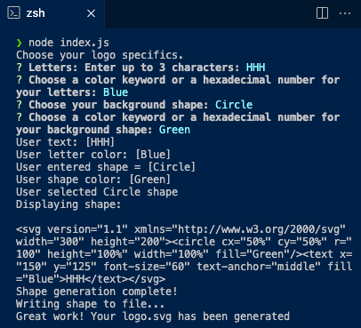
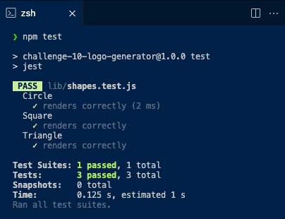
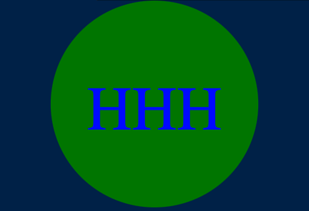

# Challenge-10-LOGO-Generator

[](https://opensource.org/licenses/MIT)
  
## Description:
The application enables users to enter inputs into their command line in order to generate a "logo.svg" file which contains the users desired logo choices as an SVG image.

## Table of Contents:
- [Overview](#Overview)
- [The Challenge](#The-Challenge)
- [Installation Process](#Installation-Process)
- [Usage Information](#Usage-Information)
- [Solution URL](#Solution-URL:)
- [Demonstration Video](#YouTube-Walkthrough-Video:)
- [Screenshots](#Screenshots:)
- [Built With](#Built-With)
- [What I Learned](#What-I-Learned)
- [License](#License)
- [Author](#Author)

# Overview

## User Story
```md
AS a freelance web developer
I WANT to generate a simple logo for my projects
SO THAT I don't have to pay a graphic designer
```

## Acceptance Criteria
```md
GIVEN a command-line application that accepts user input
WHEN I am prompted for text
THEN I can enter up to three characters
WHEN I am prompted for the text color
THEN I can enter a color keyword (OR a hexadecimal number)
WHEN I am prompted for a shape
THEN I am presented with a list of shapes to choose from: circle, triangle, and square
WHEN I am prompted for the shape's color
THEN I can enter a color keyword (OR a hexadecimal number)
WHEN I have entered input for all the prompts
THEN an SVG file is created named `logo.svg`
AND the output text "Generated logo.svg" is printed in the command line
WHEN I open the `logo.svg` file in a browser
THEN I am shown a 300x200 pixel image that matches the criteria I entered
```

## The Challenge:
Build a Node.js command-line application that takes in user inputs to generates a SVG logo and saves it as a "logo.svg" file. In addition, create a walkthrough video that demonstrates its functionality.


## Installation Process
1. Clone the repository: [Challenge-10-LOGO-Generator](https://github.com/Joey2522/Challenge-10-LOGO-Generator)
2. Using your terminal install the following: 
- Node.JS [Version 20.10.0](https://nodejs.org/en/blog/release/v20.10.0)
- Jest [Version 29.7.0](https://www.npmjs.com/package/jest)
- Inquirer.js: [Version 8.2.6](https://www.npmjs.com/package/inquirer/v/8.2.6)
3. Open the cloned repository in any source code editor.
4. Open the integrated terminal for the document and complete the respective installation guides provided above to ensure the cloned documentation will operate properly.

## Usage Instructions
1. Open the cloned repository in any source code editor.
2. Open your editors integrated terminal on index.js
3. Enter “node index.js” in the command line
4. The user will be presented with a set of sequential questions within the command line interface. The user will then provide a response to each question and proceed.
5. Once completed an SVG file named "logo.svg" will be created.
6. At your discretion, you may rename the "logo.svg" file to the file name of your choice.

## Solution URL:
[Solution URL Link:](https://github.com/Joey2522/Challenge-10-LOGO-Generator/tree/main)

## YouTube Walkthrough Video:
[Click Here to Watch](youTube link here)

## Screenshots:
### Figure 1. Command line application
 
### Figure 2. Jest Testing "npm test"

### Figure 3. Generated "logo.svg" file



## Built With
- Dynamic JavaScript
- Node.JS [Version 20.10.0](https://nodejs.org/en/blog/release/v20.10.0)
- Jest [Version 29.7.0](https://www.npmjs.com/package/jest)
- Inquirer.js: [Version 8.2.6](https://www.npmjs.com/package/inquirer/v/8.2.6)
- License Badge: [Shields.io](https://shields.io/)
- Visual Studio Code: [Website](https://code.visualstudio.com/)

## What I Learned
- Create an non-deployed application that invokes a “node index.js” in the command line to generate a logo and save it as a SVG file.
- Learned the JavaScript testing framework "Jest".

## License & Copyright ©
[](https://opensource.org/licenses/MIT) [Open Source Initiative Link](https://opensource.org/licenses/MIT)

### Copyright © 2024 Joseph Porter
```md
Permission is hereby granted, free of charge, to any person obtaining a copy
of this software and associated documentation files (the "Software"), to deal
in the Software without restriction, including without limitation the rights
to use, copy, modify, merge, publish, distribute, sublicense, and/or sell
copies of the Software, and to permit persons to whom the Software is
furnished to do so, subject to the following conditions:

The above copyright notice and this permission notice shall be included in all
copies or substantial portions of the Software.

THE SOFTWARE IS PROVIDED "AS IS", WITHOUT WARRANTY OF ANY KIND, EXPRESS OR
IMPLIED, INCLUDING BUT NOT LIMITED TO THE WARRANTIES OF MERCHANTABILITY,
FITNESS FOR A PARTICULAR PURPOSE AND NONINFRINGEMENT. IN NO EVENT SHALL THE
AUTHORS OR COPYRIGHT HOLDERS BE LIABLE FOR ANY CLAIM, DAMAGES OR OTHER
LIABILITY, WHETHER IN AN ACTION OF CONTRACT, TORT OR OTHERWISE, ARISING FROM,
OUT OF OR IN CONNECTION WITH THE SOFTWARE OR THE USE OR OTHER DEALINGS IN THE
SOFTWARE.
```

  
## Author

Follow me on Github at [Joey2522](https://github.com/Joey2522)! 


© 2024 [Joey2522](https://github.com/Joey2522). Confidential and Proprietary. All Rights Reserved.